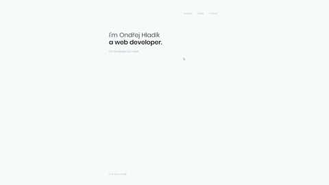

# Personal website :page_facing_up:

> Personal website built using Vue and Nuxt.js

[Live demo](https://ohladik.com)



## Build Setup

```bash
# install dependencies
$ npm install # Or yarn install

# serve with hot reload at localhost:3000
$ npm run dev

# build for production and launch server
$ npm run build
$ npm start

# generate static project
$ npm run generate
```
